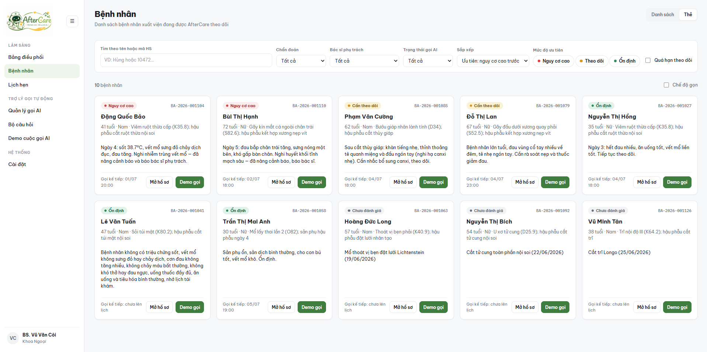
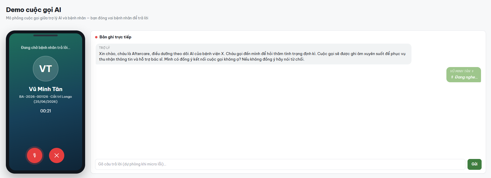
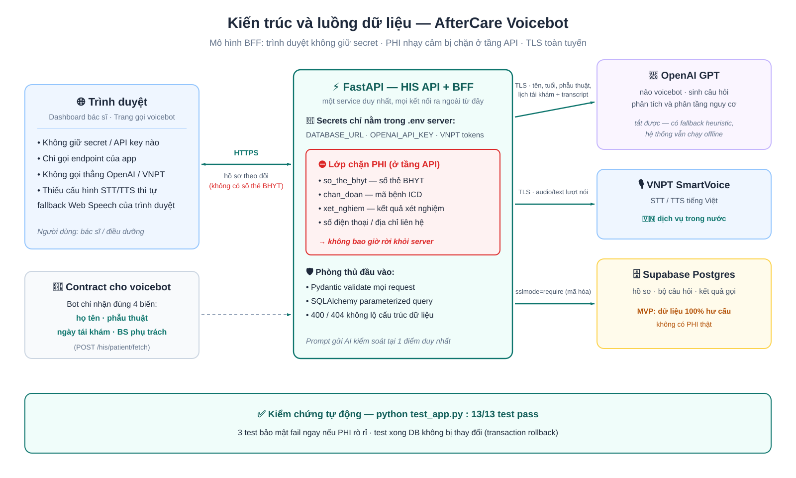
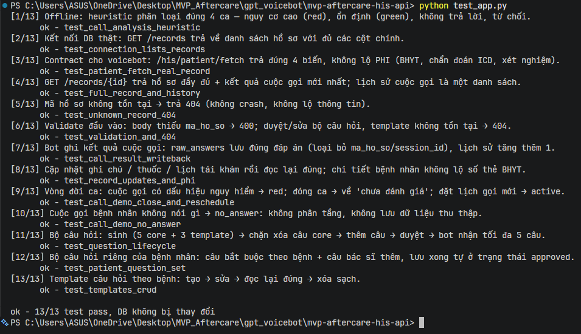
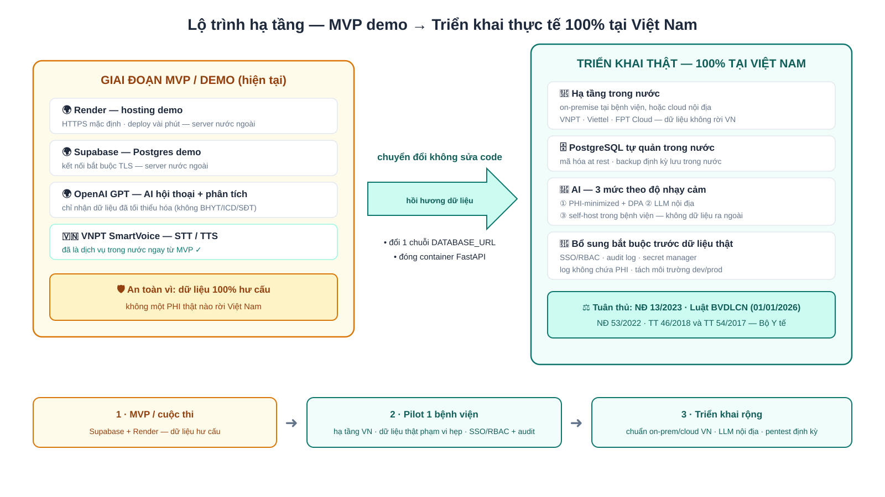

<div align="center">


# 🏥 AfterCare Voicebot

**Voicebot AI gọi điện theo dõi bệnh nhân sau xuất viện — tóm tắt cuộc gọi, phân tầng nguy cơ, cảnh báo bác sĩ.**


</div>

Bệnh nhân hậu phẫu về nhà thường "mất dấu" cho đến kỳ tái khám. **AfterCare** lấp khoảng trống đó:
bác sĩ duyệt bộ câu hỏi theo dõi cho từng bệnh nhân, voicebot AI gọi hỏi thăm định kỳ, hệ thống
tự tóm tắt hội thoại, phân loại nguy cơ 🟢 / 🟡 / 🔴 và đẩy cảnh báo những ca cần can thiệp.

---

## 📋 Mục lục

- [Tính năng](#-tính-năng)
- [Giao diện demo](#️-giao-diện-demo)
- [Kiến trúc](#-kiến-trúc)
- [Cấu trúc thư mục](#-cấu-trúc-thư-mục)
- [Bắt đầu nhanh](#-bắt-đầu-nhanh)
- [Biến môi trường](#-biến-môi-trường)
- [API chính](#-api-chính)
- [Ghi chú triển khai](#-ghi-chú-triển-khai)

## ✨ Tính năng

- **📇 Dashboard bệnh nhân** — danh sách hồ sơ hậu phẫu, tầng nguy cơ mới nhất, lần gọi cuối,
  lịch gọi kế tiếp, ca quá hạn theo dõi, lịch tái khám.
- **📝 Sinh & duyệt bộ câu hỏi** — nhóm câu **CORE** về dấu hiệu nguy hiểm (sốt, vết mổ, đau,
  chảy máu, khó thở) được khóa không cho xóa; câu cá nhân hóa do GPT sinh theo hồ sơ
  (phẫu thuật, thuốc kê, ghi chú theo dõi). Bác sĩ chỉnh sửa rồi duyệt mới dùng để gọi.
- **🤖 Voicebot GPT** — mở đầu bằng câu xin phép ghi âm cố định, xác nhận danh tính, hỏi lần
  lượt các câu đã duyệt, được phép hỏi làm rõ nhưng **không chẩn đoán**.
- **🎙️ Giọng nói tiếng Việt** — STT/TTS qua VNPT SmartVoice (nhiều giọng vùng miền); thiếu
  cấu hình thì trình duyệt tự fallback Web Speech API — demo vẫn chạy.
- **📊 Phân tích cuộc gọi** — tóm tắt hội thoại, trích đáp án theo từng biến (`sot`, `vet_mo`,…),
  phân tầng nguy cơ và cờ chuyển bác sĩ. Có GPT thì dùng GPT, không thì heuristic từ khóa —
  toàn bộ pipeline chạy được offline.
- **🚨 Cảnh báo & vòng đời ca** — thông báo bệnh nhân nguy cơ cao / quá hạn gọi; đóng ca đưa
  bệnh nhân về "chưa đánh giá" nhưng giữ nguyên lịch sử cuộc gọi.
- **🔒 An toàn dữ liệu** — mọi secret (OpenAI, VNPT, DB) chỉ ở server; trình duyệt chỉ gọi
  endpoint của app (mô hình BFF). PHI nhạy cảm (`so_the_bhyt`, ICD, xét nghiệm) không bao giờ
  gửi cho bot hay lộ ra API.

## 🖥️ Giao diện demo

**Dashboard bệnh nhân** — tầng nguy cơ 🟢🟡🔴, lần gọi cuối, lịch gọi kế tiếp, ca quá hạn:



**Cuộc gọi demo với voicebot** — mở đầu xin phép ghi âm, hỏi theo bộ câu hỏi bác sĩ đã duyệt:



## 🏗 Kiến trúc



Luồng nghiệp vụ: **xem bệnh nhân → sinh & duyệt câu hỏi → voicebot gọi → phân tích, phân tầng
nguy cơ → dashboard & cảnh báo → đóng ca / đặt lịch gọi tiếp**.

## 📁 Cấu trúc thư mục

```
mvp-aftercare-his-api/
├── app/
│   ├── main.py           # Toàn bộ endpoint FastAPI + mount frontend tĩnh
│   ├── gptbot.py         # Bộ não GPT của voicebot (thay VNPT Smartbot cũ)
│   ├── call_analysis.py  # Tóm tắt + phân tầng nguy cơ (GPT / heuristic offline)
│   ├── questions_gen.py  # Sinh bộ câu hỏi (CORE + cá nhân hóa / template)
│   ├── smartvoice.py     # Client VNPT SmartVoice STT/TTS (creds chỉ ở server)
│   ├── smartbot.py       # Client VNPT Smartbot cũ (legacy, không còn dùng)
│   ├── models.py         # SQLAlchemy models khớp schema Supabase có sẵn
│   ├── schemas.py        # Pydantic request/response
│   ├── config.py         # Biến môi trường (pydantic-settings)
│   ├── db.py             # Engine + session (Supavisor session pooler)
│   ├── seed_demo.py      # Seed dữ liệu demo, chạy lại được (idempotent)
│   └── static/           # Frontend: patients, case, questions, call, manager…
├── create_tables.sql     # Tạo bảng phía AfterCare (idempotent)
├── test_app.py           # Bộ test tự động (offline + smoke + write-rollback)
├── .env.example          # Mẫu biến môi trường
└── requirements.txt
```

> 💡 Thư mục `../SmartVoice/` cạnh repo chứa tài liệu API + Postman collection của VNPT
> SmartVoice để tham khảo — không phải code.

## 🚀 Bắt đầu nhanh

**Yêu cầu:** Python 3.11+ và một database Supabase Postgres đã có bảng `"Hồ sơ bệnh nhân"`.

Cài đặt & chạy **1 lệnh** (sau khi đã điền `DATABASE_URL` vào `.env` — copy từ `.env.example`):

```bash
pip install -r requirements.txt && uvicorn app.main:app
```

Chi tiết từng bước cho lần đầu:

```bash
# 1. Cài dependencies
pip install -r requirements.txt

# 2. Cấu hình
cp .env.example .env        # điền DATABASE_URL (bắt buộc), các key khác tùy chọn

# 3. Lần đầu: tạo bảng + seed dữ liệu demo
#    chạy create_tables.sql trong Supabase SQL editor, rồi:
python -m app.seed_demo

# 4. Chạy
uvicorn app.main:app --reload
```

Mở <http://localhost:8000> — frontend được FastAPI serve luôn. Swagger UI tại `/docs`.

**Test tự động** — 13 test: logic phân loại (offline), smoke read-only, và toàn bộ endpoint ghi
(mỗi test bọc trong transaction rollback nên **không để lại dữ liệu** trong DB):

```bash
python test_app.py
```



## ⚙️ Biến môi trường

| Biến | Bắt buộc | Ghi chú |
|---|:---:|---|
| `DATABASE_URL` | ✅ | Supavisor **session pooler** cổng 5432, scheme `postgresql+psycopg`, username `postgres.[PROJECT_REF]`, password đã URL-encode, `?sslmode=require`. ⚠️ Không dùng host `db.[ref].supabase.co` (IPv6-only). |
| `OPENAI_API_KEY`, `OPENAI_MODEL` | ➖ | Bộ não voicebot + sinh câu hỏi + phân tích cuộc gọi. Thiếu key → fallback template & heuristic, demo vẫn chạy. |
| `SMARTVOICE_BASE_URL`, `SMARTVOICE_STT_*`, `SMARTVOICE_TTS_*` | ➖ | STT/TTS của VNPT, creds riêng từng dịch vụ. Thiếu dịch vụ nào frontend fallback Web Speech cho dịch vụ đó. |
| `SMARTVOICE_TTS_REGION`, `SMARTVOICE_TTS_SPEED` | ➖ | Giọng đọc (vd `female_north`, `male_south`…) và tốc độ (0.5–2). |
| `BOT_ID`, `SMARTBOT_*` | ➖ | Legacy — Smartbot cũ đã thay bằng GPT, để trống. |

Secret chỉ nằm trong `.env` (gitignored). Trình duyệt **không bao giờ** gọi thẳng OpenAI/VNPT —
đó là lý do tồn tại của các endpoint `/bff/*`.

## 🔌 API chính

<details>
<summary><b>Dashboard / frontend</b></summary>

| Endpoint | Mô tả |
|---|---|
| `GET /his/patients` | Danh sách bệnh nhân + tầng nguy cơ, lần gọi cuối, lịch gọi kế |
| `GET /his/patient/{ma_ho_so}` | Chi tiết hồ sơ (không trả `so_the_bhyt`) |
| `GET /his/patient/{ma_ho_so}/call-results` | Lịch sử cuộc gọi: transcript, đáp án, tóm tắt |
| `GET /his/patient/{ma_ho_so}/call-preview` | Kịch bản cuộc gọi sắp tới (read-only) |
| `GET/POST/PUT/DELETE /his/templates` | Bộ câu hỏi mẫu theo bệnh |
| `GET /his/performance` · `/his/notifications` · `/his/appointments` | Số liệu, cảnh báo, lịch tái khám |

</details>

<details>
<summary><b>Bộ câu hỏi</b></summary>

| Endpoint | Mô tả |
|---|---|
| `POST /questions/generate` | Sinh bản nháp cho bệnh nhân |
| `PUT /questions/{set_id}` | Lưu chỉnh sửa (chặn xóa câu CORE) |
| `PUT /questions/{set_id}/approve` | Duyệt bộ câu hỏi |
| `GET/POST /his/patient/{ma_ho_so}/question-set` | Bộ câu hỏi riêng: câu bắt buộc theo bệnh + câu bổ sung |
| `POST /questions/ai-suggest` | AI gợi ý câu hỏi thêm (chỉ preview, không lưu) |

</details>

<details>
<summary><b>Voicebot (BFF)</b></summary>

| Endpoint | Mô tả |
|---|---|
| `POST /bff/conversation` | Một lượt hội thoại GPT — `{text, session_id, ma_ho_so, first_turn}` |
| `POST /bff/stt` · `POST /bff/tts` | Proxy VNPT SmartVoice |
| `GET /bff/voice-config` | Cho frontend biết STT/TTS nào đã cấu hình |
| `POST /his/call-demo/save` | Lưu cuộc gọi demo: phân tích + ghi `call_results` |

</details>

<details>
<summary><b>Bot-facing / write-back</b></summary>

| Endpoint | Mô tả |
|---|---|
| `POST /his/patient/fetch` · `/his/questions/fetch` | Contract `set_variables` cho bot |
| `POST /his/call-result` | Bot ghi kết quả cuộc gọi |
| `PUT /records/{ma_ho_so}/monitoring` · `ghi-chu` · `thuoc` · `lich-tai-kham` | Cập nhật theo dõi, ghi chú, thuốc, lịch tái khám |
| `POST /records/{ma_ho_so}/close` | Đóng ca (giữ lịch sử cuộc gọi) |
| `GET /health` | Health check (Render) |

</details>

## 📌 Ghi chú triển khai

- Deploy dạng **một web service** (đã chạy trên Render). Mọi timestamp ghi UTC aware
  (`timestamptz`) để máy local (UTC+7) và Render (UTC) không lệch nhau.
- Lịch sử hội thoại voicebot giữ **trong RAM** (single-process) — chạy nhiều worker hoặc cần
  sống sót qua restart thì chuyển sang Redis/DB.
- Không có OpenAI/SmartVoice key vẫn demo được: câu hỏi dùng template, phân tích dùng
  heuristic, giọng nói dùng Web Speech của trình duyệt.

Lộ trình hạ tầng khi triển khai thực tế (100% đặt tại Việt Nam):



---

<div align="center">


<sub>MVP demo — không dùng cho chẩn đoán y khoa. Voicebot chỉ hỏi thăm và chuyển thông tin cho bác sĩ phụ trách.</sub>
</div>
